# Chaos Engineering Platform

障害を意図的に注入し、システムの自己回復能力と SLO への影響を自動計測・停止するプラットフォーム。

## Architecture

```
┌─────────────────────────────────────┐
│  Chaos Control Plane                │
│  React SPA (CloudFront + Cognito)   │
│  API Gateway → Lambda → DynamoDB    │
│  実験定義 / 実行 / 停止 / 評価結果   │
└──────────────┬──────────────────────┘
               │ DynamoDB polling
┌──────────────▼──────────────────────┐
│  chaos-agent (EKS Fargate)          │
│  env patch / Pod scale → service-b  │
│  ・Pod kill                         │
│  ・CPU stress (bytearray busy-loop) │
│  ・Memory stress (150MB bytearray)  │
│  ・HTTP error inject (FAULT_RATE)   │
│  ・Network latency (tc netem)       │
└──────────────┬──────────────────────┘
               │ メトリクス
┌──────────────▼──────────────────────┐
│  Observability                      │
│  ALB → CloudWatch (ALB metrics)     │
│  service-b EMF (latency / errors)   │
│  Lambda: sli_calculator (毎分)      │
│  Lambda: auto_stopper (毎分)        │
│  DynamoDB Streams → Evaluator Lambda│
│  CloudWatch Alarms (9個) → SNS      │
│  Evaluator → Slack 通知             │
└─────────────────────────────────────┘
```

詳細は [アーキテクチャ図](docs/architecture-overview.drawio) を参照。

## Tech Stack

| Category | Technology |
|---|---|
| Language | Python 3.13 |
| Infrastructure | Terraform v1.8.5 |
| Container Orchestration | EKS Fargate |
| Fault Injection Targets | FastAPI × 2 (service-a + service-b) |
| Fault Types | pod_kill / cpu_stress / memory_stress / http_error_inject / network_latency |
| Service Mesh | Envoy sidecar (timeout + retry + circuit breaker) |
| Observability | CloudWatch ALB metrics + EMF + Container Insights |
| SLO Management | DynamoDB + sli_calculator Lambda + auto_stopper Lambda |
| Evaluation | DynamoDB Streams → Evaluator Lambda (Phase A / Phase B / Safety Net) |
| Alerting | CloudWatch Alarms (9個) → SNS → Slack |
| Frontend | React SPA (Vite + TypeScript) → CloudFront + Cognito |
| CI/CD | GitHub Actions |
| ADR | 050本（全設計判断を記録） |

## Quick Start

### Prerequisites

- AWS CLI v2 configured (`aws configure`)
- Terraform v1.8.5+
- kubectl v1.31+
- Docker

### 1. Bootstrap Terraform Backend

```bash
cd terraform/bootstrap
terraform init
terraform apply
```

### 2. Deploy Infrastructure

```bash
cd terraform
terraform init
terraform apply -var="slack_webhook_url=https://hooks.slack.com/..."
```

### 3. Build & Push Docker Images

```bash
AWS_ACCOUNT_ID=203553641035
AWS_REGION=ap-northeast-1
ECR_BASE=$AWS_ACCOUNT_ID.dkr.ecr.$AWS_REGION.amazonaws.com/chaos-platform

aws ecr get-login-password | docker login --username AWS --password-stdin $ECR_BASE

docker build -t $ECR_BASE/service-a:latest ./services/service-a
docker push $ECR_BASE/service-a:latest

docker build -t $ECR_BASE/service-b:latest ./services/service-b
docker push $ECR_BASE/service-b:latest
```

### 4. Deploy to EKS

```bash
aws eks update-kubeconfig --name chaos-platform-cluster --region ap-northeast-1

IMAGE_A=$AWS_ACCOUNT_ID.dkr.ecr.$AWS_REGION.amazonaws.com/chaos-platform/service-a:latest
IMAGE_B=$AWS_ACCOUNT_ID.dkr.ecr.$AWS_REGION.amazonaws.com/chaos-platform/service-b:latest

sed "s|SERVICE_A_IMAGE|$IMAGE_A|g" k8s/service-a.yaml | kubectl apply -f -
sed "s|SERVICE_B_IMAGE|$IMAGE_B|g" k8s/service-b.yaml | kubectl apply -f -

kubectl get pods
```

### 5. Run a Chaos Experiment

実験は **React フロントエンド（GUI）** から実行する。CLI は廃止済み。

1. CloudFront URL にアクセス（Cognito 認証）
2. 「新規実験」フォームでフォルトタイプ・duration・強度・SLO 閾値を設定
3. 「実験開始」→ chaos-agent が障害を注入
4. 実験完了後、Evaluator Lambda が Phase A / Phase B / Safety Net を自動判定
5. 結果が UI にリアルタイム反映・Slack に通知

## Auto-Stop Flow

```
EventBridge (1分ごと)
  → sli_calculator Lambda
      → ALB CloudWatch メトリクスからエラーレート取得
      → DynamoDB SLI_TABLE に書き込み
  → auto_stopper Lambda
      → SLI > SLO 閾値？
          → emergency_stop=true をセット
          → chaos-agent が emergency_recover を実行
              ├ scale=0 → トラフィック遮断
              ├ FAULT_RATE 環境変数を削除
              ├ 30s 待機
              └ scale=2 → rolling update → 回復

EventBridge → DynamoDB Streams
  → Evaluator Lambda (status=completed をトリガー)
      → 5分バッファ後に CloudWatch 再評価
      → Phase A / Phase B / Safety Net を判定
      → Slack 通知
```

## GitHub Actions

| Workflow | Trigger | Action |
|---|---|---|
| `terraform.yml` | PR to main | `terraform plan` → PR コメント |
| `terraform.yml` | Push to main | `terraform apply` |
| `deploy.yml` | Push to main (services/k8s 変更) | ECR push → kubectl apply |

## GitHub Secrets

| Secret | Description |
|---|---|
| `AWS_ACCESS_KEY_ID` | AWS アクセスキー |
| `AWS_SECRET_ACCESS_KEY` | AWS シークレットキー |
| `SLACK_WEBHOOK_URL` | Slack Incoming Webhook URL |


---

## 目次

1. [システム概要](#1-システム概要)
2. [実験フロー](#2-実験フロー)
3. [レジリエンス設計](#3-レジリエンス設計)
4. [実験一覧と評価結果](#4-実験一覧と評価結果)


---

## 1. システム概要

**「本番さながらのカオスエンジニアリング基盤を 1 人で設計・実装・運用まで完結させた」**

### コンポーネント構成

| レイヤー | コンポーネント |
|---|---|
| ユーザー | CloudFront → React (Cognito 認証) |
| API | ALB → service-a (FastAPI) |
| 依存 | service-a → Envoy sidecar → service-b (FastAPI) |
| フォルト対象 | service-b (EKS Fargate, `chaos` namespace) |
| 実験制御 | chaos-agent (EKS Fargate, DynamoDB polling) |
| 計測 | ALB アクセスログ → CloudWatch / EMF |
| 評価 | DynamoDB Streams → Evaluator Lambda → DynamoDB |
| 監視 | CloudWatch Alarms → SNS → auto_stopper Lambda |

### 設計のポイント

- **フォルト対象を chaos namespace に分離**: service-b のみに障害を注入し、service-a への波及を Envoy でコントロール
- **評価を自動化**: 実験完了 → DynamoDB Streams → Evaluator Lambda が Phase A / Phase B / Safety Net の 3 段階で自動判定
- **ADR 50 本**: 全設計判断を Architecture Decision Record として記録（001〜050）

---

## 2. 実験フロー

```
① 実験登録（React UI / REST API）
    fault_type, duration, intensity, SLO 閾値 を指定
          ↓
② フォルト注入（chaos-agent）
    DynamoDB polling で実験を検出
    → env patch / Pod scale で service-b に障害を注入
          ↓
③ メトリクス監視
    ALB アクセスログ → CloudWatch Logs Insights
    service-b は EMF でレイテンシ・エラー率を出力
    auto_stopper が SLI 超過を常時監視
          ↓
④ 評価（Evaluator Lambda）
    実験完了 (status=completed) をトリガーに起動
    Phase A: 注入中の指標を検証
    Phase B: 回復後の指標・TTR を検証
    Safety Net: auto_stopper の発動有無を照合
          ↓
⑤ 結果表示
    evaluation_result (PASS/FAIL) を DynamoDB に書き込み
    React が 1 秒ポーリングで反映
```

> 詳細フロー図: [docs/chaos-experiment-flow.drawio](docs/chaos-experiment-flow.drawio)

### 実験一覧画面

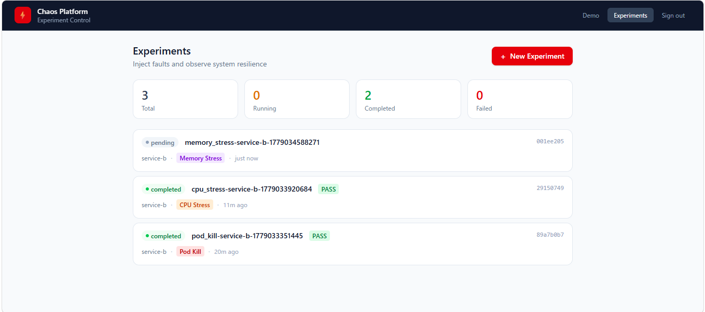

### 新規実験フォーム

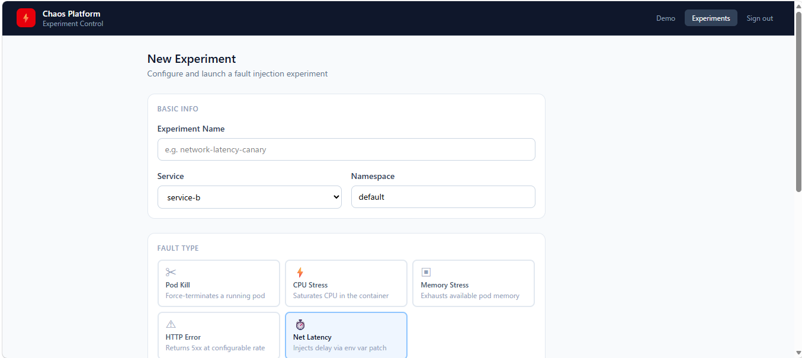

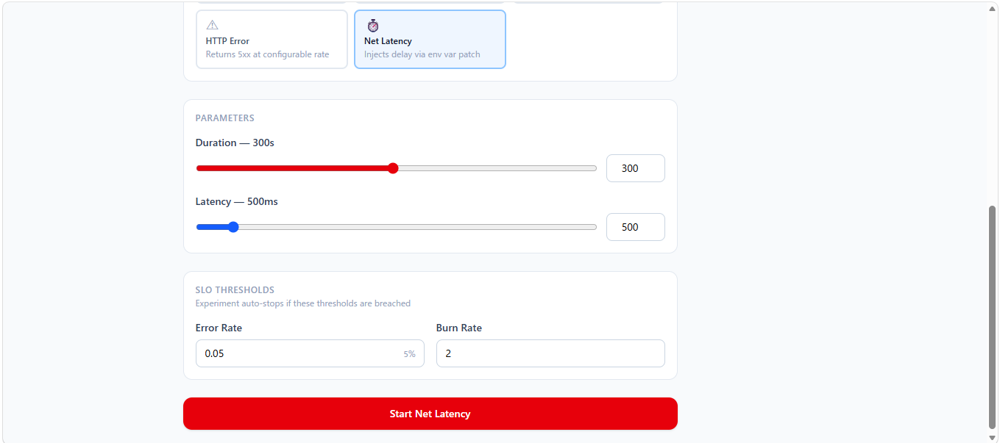

---

## 3. レジリエンス設計

### Phase A / Phase B とは

各実験は **2 段階**で評価する。

| フェーズ | タイミング | 問い |
|---|---|---|
| **Phase A（Absorb）** | フォルト注入中 | 障害が起きているか ＋ システムが吸収できているか |
| **Phase B（Recovery）** | フォルト終了 + offset 秒後 | 正常に戻っているか（TTR = Time to Recovery） |

> Phase A は「障害の存在証明」と「吸収の証明」を同時に要求する。  
> Phase B は「回復速度」を問う。offset はローリングアップデートの完了待ちに使う。

---

### 障害 × レジリエンス設計 対応表

| 障害 | Phase A で働くレジリエンス設計 | Phase B で働くレジリエンス設計 |
|---|---|---|
| network_latency | Envoy timeout (200ms) + Stale cache | 遅延除去で即回復 |
| pod_kill | Envoy retry (connect-failure) | Fargate 自動再起動 |
| cpu_stress | Envoy timeout で上限を打ち切る | HPA スケールアウト（CPU 70%） |
| memory_stress | 150MB 設計（OOMKill 回避） | rolling update でプロセス再起動 |
| http_error_inject | auto_stopper 発動（SLI 超過検知） | emergency_recover（scale=0 → 2） |

---

### 3-1. Envoy Circuit Breaker + Retry（ADR 006）

**対象障害**: `network_latency`（Phase A）、`pod_kill`（Phase A）

```
service-a → [Envoy sidecar]
                ├ upstream timeout: 200ms      ← network_latency の遅延をここで打ち切る
                ├ retry: 2 回（5xx / connect-failure）  ← pod_kill 直後の接続失敗を吸収
                └ circuit breaker: consecutive_5xx ≥ 3 で open
```

- **network_latency**: service-b の 500ms 遅延を Envoy が 200ms でカット → service-a p95 ≤ 250ms を維持（Phase A 合格基準）
- **pod_kill**: Pod 消滅直後の `connect-failure` を Envoy がリトライ → error_rate ≤ 1% を維持（Phase A 合格基準）

---

### 3-2. Live-first Stale Cache Fallback（ADR 007）

**対象障害**: `network_latency`（Phase A）

```
正常時:  service-a → service-b（成功）→ レスポンスをキャッシュに書き込んで返す
障害時:  service-a → service-b（Envoy timeout）→ キャッシュから stale データを即座に返す
```

| | service-a p95 | 判定 |
|---|---|---|
| stale cache なし（修正前） | 837ms | FAIL（≤ 250ms 違反） |
| stale cache あり（修正後） | 220ms | **PASS** ✓ |

Envoy timeout (200ms) だけでは `service-b 応答待ち → タイムアウト` の分がレイテンシに乗る。  
stale cache を返すことで service-a の処理が完結し、250ms を下回れた。

---

### 3-3. HPA スケールアウト

**対象障害**: `cpu_stress`（Phase B）

```
Phase A: CPU 80% 負荷 → service-b が重くなる → Envoy timeout で上限カット
    ↓ 実験終了 → CPU 負荷プロセスが消える
Phase B: HPA が CPU 70% を超えた時点でスケールアウト済み
    → 追加 Pod が負荷を分散 → p95 ≤ 500ms で回復（TTR 30s）
```

- Phase A は「劣化許容（p95 ≤ 1000ms）」— スケールアウトは間に合わないが Envoy がさばく
- Phase B は HPA による回復が TTR の主役

---

### 3-4. OOMKill 回避設計（ADR 047）

**対象障害**: `memory_stress`（Phase A）

```
service-b limits: 256Mi
注入メモリ:       150MB（limits の 58%）
Python ランタイム: ~60MB
合計:             ~210MB → 256Mi 未満 → OOMKill しない
```

- OOMKill が起きると Pod が即死して pod_kill と同じ事象になる → memory_stress を独立した実験として成立させるために「圧迫するが殺さない」量を ADR 047 で決定
- Phase A は「メモリ圧迫下でも error_rate ≤ 5%」を問う（実測: 0.000）

---

### 3-5. auto_stopper（ADR 040 / ADR 049 / ADR 050）

**対象障害**: `http_error_inject`（Phase A + Phase B + Safety Net）

```
Phase A:
  SLI 監視ループ（chaos-agent）
      ↓ origin error_rate > 閾値 を検知（実測: 300.9s で発動）
  auto_stopper.fire()
      ↓ DynamoDB: emergency_stop=true

Phase B（emergency_recover スレッド）:
      ├ scale=0 → トラフィック遮断（Sorry Page 表示）
      ├ 環境変数 FAULT_RATE を削除（フォルト除去）
      ├ 30 秒待機
      └ scale=2 → rolling update（〜90 秒）→ 回復完了
          ↓
  Phase B 計測ウィンドウ開始（fault_end + offset 180s）
  → error_rate ≤ 0.5%、TTR ≤ 240s を検証
```

- Phase A 合格 = 「auto_stopper が 360s 以内に発動した」
- Phase B 合格 = 「emergency_recover 完了後、誤り率が 0.5% 以下に収まった」
- offset 180s の根拠: emergency_recover 最悪 120s + 60s バッファ（ADR 049）
- duration=600s 必須: CloudWatch ALB メトリクス遅延 ~4 分 + auto_stopper 競合（ADR 050）

---

### 3-6. 商品詳細デモ画面（ADR 031）

`/aggregate/products/{id}` が `resilience.source` メタデータを返し、UI がシステム状態をリアルタイムに反映。

| 状態 | resilience.source | 表示 |
|---|---|---|
| 正常時（stale cache なし） | `fresh` | Pro Mechanical Keyboard ¥12,980 ★4.6 |
| 障害時（stale cache あり） | `fallback` | 🛒 商品情報を一時的に取得できません |

カオスエンジニアリングの結果がユーザー体験として可視化される唯一の画面。

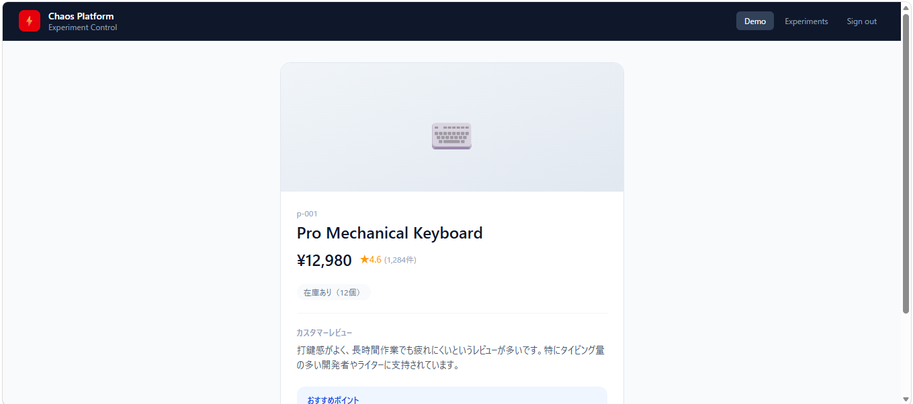

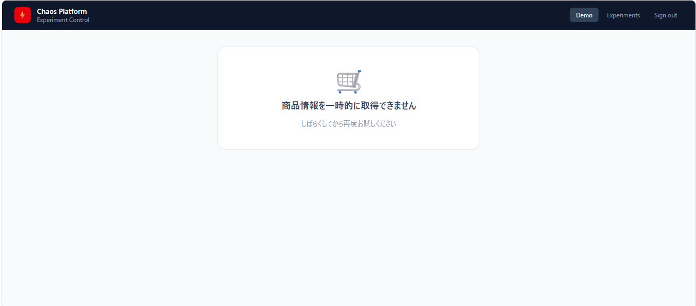

---

## 4. 実験一覧と評価結果

### 4-1. network_latency

| 項目 | 内容 |
|---|---|
| 注入障害 | service-b への 50% リクエストに 500ms 遅延 |
| 本番シナリオ | 依存 API のレスポンス劣化・ネットワーク輻輳 |
| Phase A 合格基準 | service-b p95 ≥ 450ms / service-a p95 ≤ 250ms |
| Phase B 合格基準 | service-a p95 ≤ 250ms / TTR ≤ 150s |
| 基準の根拠 | 250ms = Envoy timeout 200ms + stale cache 返却 ≈ 50ms |
| 実測値 | service-b p95 **995.5ms** ✓ / service-a p95 **220.2ms** ✓ / Phase B **217.9ms** TTR 30s ✓ |
| 判定 | **PASS** |

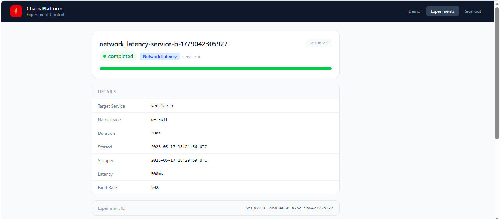

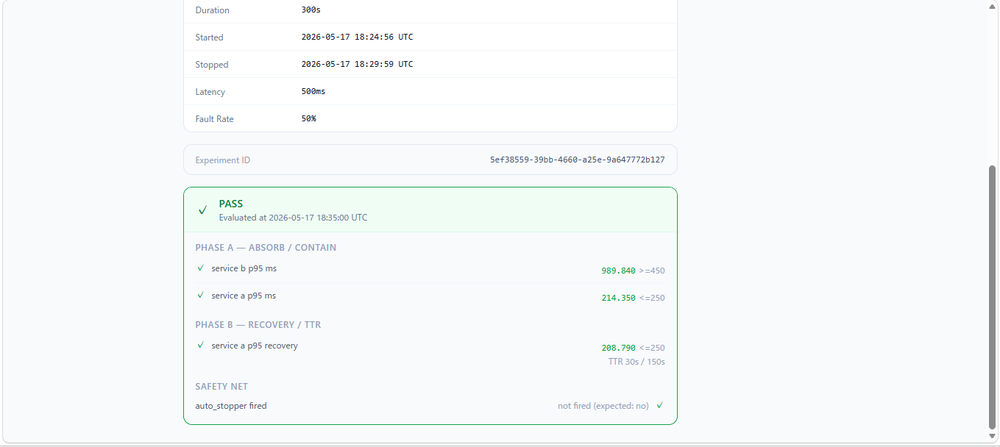

---

### 4-2. pod_kill

| 項目 | 内容 |
|---|---|
| 注入障害 | service-b Pod を強制削除（scale=0 → 即時再起動） |
| 本番シナリオ | OOMKill / ノード障害 / デプロイ失敗によるゼロダウン |
| Phase A 合格基準 | error_rate ≤ 1%（Pod 再起動中もほぼエラーを出さない） |
| Phase B 合格基準 | error_rate ≤ 0.5% / TTR ≤ 60s |
| 基準の根拠 | EKS rolling update + Envoy retry で大半を吸収。1% = 再起動期間の取りこぼし許容値 |
| 実測値 | Phase A error_rate **0.000** ✓ / Phase B **0.000** TTR 30s ✓ |
| 判定 | **PASS** |

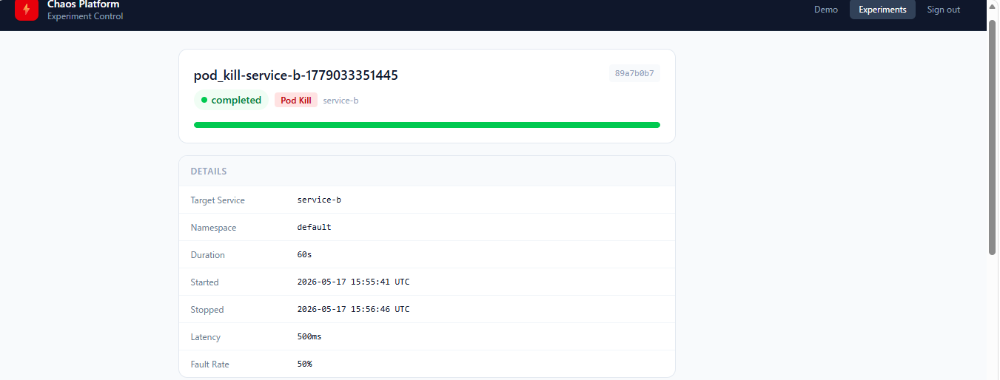

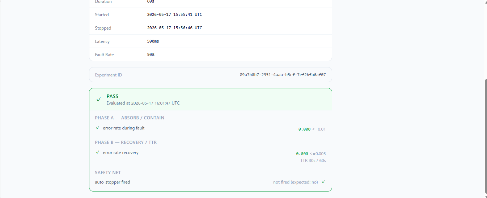

---

### 4-3. cpu_stress

| 項目 | 内容 |
|---|---|
| 注入障害 | service-b CPU を 80% 継続負荷（bytearray busy-loop） |
| 本番シナリオ | トラフィックスパイク / 暗号化処理ボトルネック |
| Phase A 合格基準 | p95 ≤ 1000ms / error_rate ≤ 5% |
| Phase B 合格基準 | p95 ≤ 500ms / TTR ≤ 120s |
| 基準の根拠 | 1000ms = 通常の 2× を劣化上限。回復後 500ms = 1.2× 以内に収める |
| 実測値 | Phase A p95 **527.9ms** ✓ / Phase B **478.4ms** TTR 30s ✓ |
| 判定 | **PASS** |

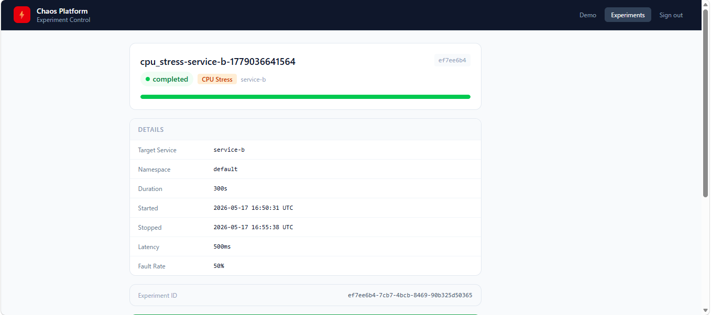


---

### 4-4. memory_stress

| 項目 | 内容 |
|---|---|
| 注入障害 | service-b に 150MB の bytearray を確保しメモリ圧迫 |
| 本番シナリオ | メモリリーク / キャッシュ肥大化 |
| Phase A 合格基準 | error_rate ≤ 5%（GC 負荷・スラッシング下でも応答できる） |
| Phase B 合格基準 | error_rate ≤ 0.5% / TTR ≤ 150s |
| 基準の根拠 | 150MB = service-b limits 256Mi の 58%。OOMKill を回避しつつ確実に圧迫（ADR 047） |
| 実測値 | Phase A error_rate **0.000** ✓ / Phase B **0.000** TTR 30s ✓ |
| 判定 | **PASS** |

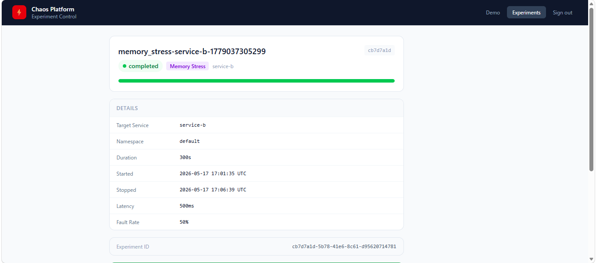

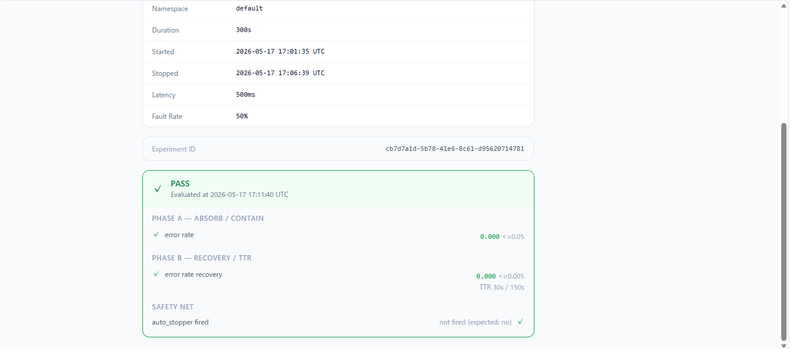

---

### 4-5. http_error_inject

| 項目 | 内容 |
|---|---|
| 注入障害 | service-b がリクエストの 50% に 500 エラーを返す |
| 本番シナリオ | 依存サービスの部分障害 / デプロイ Rollback |
| Phase A 合格基準 | origin error_rate ≥ 5% / auto_stopper が 6 分以内に発動 |
| Phase B 合格基準 | error_rate ≤ 0.5% / TTR ≤ 240s |
| Safety Net 合格基準 | auto_stopper 発動 expected: yes / burn rate ≤ 600× |
| 基準の根拠 | offset 180s = emergency_recover 最悪 120s + 60s バッファ / TTR 240s = 180s + 60s 猶予（ADR 049） |
| 実測値 | origin error_rate **0.125** ✓ / auto_stopper **300.9s** ✓ / Phase B **0.000** TTR 30s ✓ |
| 判定 | **PASS** |

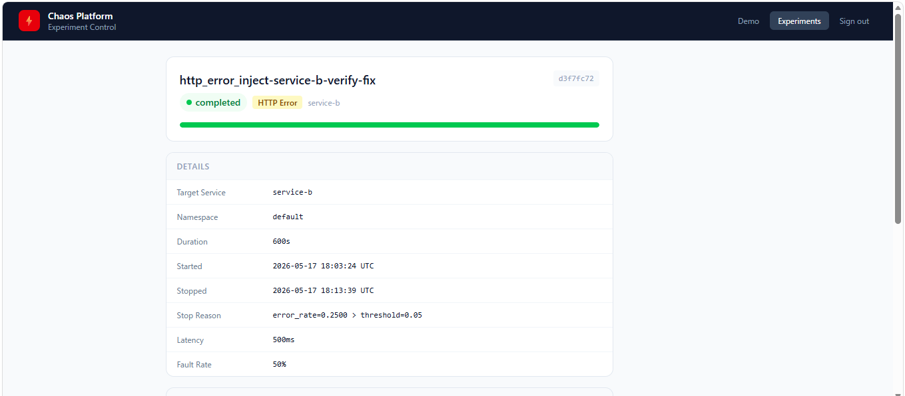

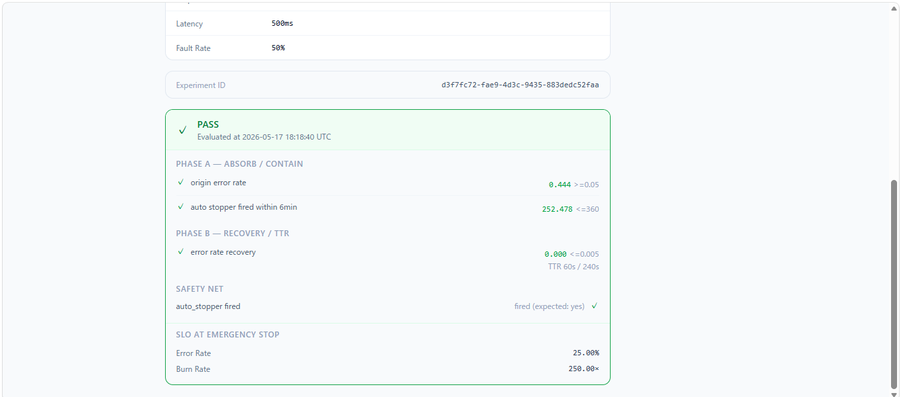

---

### 実験結果サマリー
c
| 実験 | Phase A | Phase B | Safety Net | 総合 |
|---|---|---|---|---|
| network_latency | ✓ p95 220ms ≤ 250ms | ✓ 217ms TTR 30s | — | **PASS** |
| pod_kill | ✓ error 0.000 ≤ 0.01 | ✓ 0.000 TTR 30s | — | **PASS** |
| cpu_stress | ✓ p95 527ms ≤ 1000ms | ✓ 478ms TTR 30s | — | **PASS** |
| memory_stress | ✓ error 0.000 ≤ 0.05 | ✓ 0.000 TTR 30s | — | **PASS** |
| http_error_inject | ✓ error 0.125 ≥ 0.05 | ✓ 0.000 TTR 30s | ✓ auto_stopper 300s | **PASS** |
